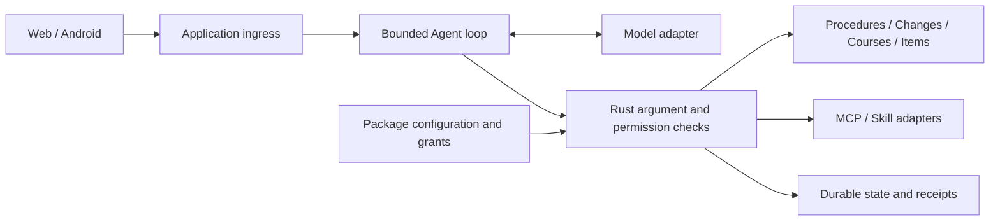

# USTC Campus Agent

A campus assistant for administrative procedures, calendar changes, course comparison and personal items.
Its Plugin Market configures MCP tools and Skill guidance for the Agent. Models propose calls; Rust validates permissions and executes them.

[简体中文](README.md) · [Capabilities and scoring evidence](docs/features/06-mvp-core-capabilities.md) · [Demo walkthrough](docs/guides/competition-demo.md) · [Documentation](docs/README.md)

A student competition project, not an official USTC service. The current runnable version is a loopback demo with fixed sources and a demo identity. Production multi-user hosting and university SSO are not integrated.

<a id="overview"></a>
<a id="features"></a>

## What works

| Task | Current result | Inputs and conditions |
|---|---|---|
| Transcript-certificate procedure | Conditions, steps, official links and an exportable personal checklist | Fixed reviewed procedure data |
| Academic-calendar changes | Revision differences, sources and a change board | Fixed reviewed calendar examples |
| Course comparison | Candidate plans and reasons from a demo profile | Explicit consent for the current request; data limits below |
| Personal items | Record and list; preview/confirm dated additions, edits and deletion; retain after restart | Campus time shown explicitly; no reminder delivery |
| Agent extensions | Install, configure, probe, grant, enable, disable and revoke packages | Reviewed single-component, public-read MCP or Skill packages |

Chat supports saved history, follow-up questions, rename/delete and automatic `YYMMDD|topic` titles.
The model selector sits beside the composer. Tool progress reflects actual execution, and administrator demo controls are secondary.

<a id="quick-start"></a>

## Run from source

Use Linux/WSL, Git and the Rust toolchain pinned by the repository:

```bash
git clone https://github.com/Develata/ustc-campus-agent.git
cd ustc-campus-agent
bash scripts/run_three_plugin_mvp.sh
```

Open <http://127.0.0.1:8787>. These Chinese prompts exercise the deterministic demo:

```text
成绩单证明怎么办？
校历最近有什么变化？
记录事项：准备成绩单申请材料
列出我的待办事项
```

They query a transcript procedure, inspect calendar changes, record an item and list items.
For course planning, create a demo profile first and consent to its use in the current Chat request.
For packaged execution, see the [Docker Compose guide](deploy/mvp-compose/README.md).
Current development sources and the historical R3.1 package have different feature scopes.
Mock execution needs no key or model network; an initial build may still download dependencies and images.

### Models and plugins

| Mode | Scope |
|---|---|
| `mock` | Deterministic execution of four built-in campus tools; no installed MCP/Skill calls |
| `local-chat` | Text-only connection testing with a small local model; no tools |
| `openai-compatible` | A configured tool-capable model can call currently authorized built-in and package tools |

Endpoints and private key files are configured on the server. The browser selects an admitted model ID.
See [model configuration](docs/guides/model-selection.md) and [MCP/Skill configuration](docs/guides/mcp-skills.md).
Installation does not grant permission; every invocation checks current state, arguments and authority.

<a id="architecture"></a>

## Implementation and competition evidence



| Scoring dimension | Demonstrable evidence |
|---|---|
| Innovation | Campus tasks, source checks and permissioned plugins through one Chat entry |
| Practicality | Working procedure lookup, saved items and course comparison with explicit prerequisites |
| Technical difficulty | Model/tool protocols, validation, source boundaries, bounded execution, revocation and exact retries |
| Completion | Runnable Web and Android debug clients, verification commands, architecture and recording instructions |

See the [capability and evidence map](docs/features/06-mvp-core-capabilities.md) for detailed criteria.
Planned RAG, multi-agent workflows and production features are not presented as implemented. Test evidence does not establish a competition score.

<a id="privacy"></a>
<a id="boundaries"></a>

## Data and current limits

- Procedures and calendar changes use fixed reviewed data, not live campus retrieval. The course catalog mixes synthetic course facts with an iCourse aggregate-rating snapshot; permission for the latter remains unresolved.
- Profile use requires request-specific consent. Item writes require explicit intent or confirmation of a stored proposal. Dated proposals and edits are supported; batch writes, reminder delivery and streaming remain unimplemented.
- The server binds to loopback. Model credentials come from private server files and never enter the page, repository or tool receipts.
- Planned user entry is SSO or administrator-configured accounts, without self-registration. Production authentication, multi-user hosting and real university identity integration remain unfinished.

<a id="android"></a>

## Android

The debug APK uses `adb reverse` to reach the same Rust backend and renders Chat and plugins in Android WebView.
See the [Android guide](docs/guides/android-demo.md) for installation, explicit device selection and evidence boundaries.
The current local build passed; Xiaomi installation was blocked by device policy, so physical-device feature acceptance remains unverified.

<a id="development"></a>

## Development and verification

```bash
cargo fmt --all -- --check
cargo clippy --locked --all-targets --all-features -- -D warnings
cargo test --locked --all-targets --all-features
python3 scripts/check_repo_contracts.py
```

Run affected-module tests during development and the baseline at integration checkpoints.
These commands describe checks, not their results. See the [development guide](docs/guides/development.md),
[acceptance matrix](docs/acceptance/matrix.tsv) and [AGENTS.md](AGENTS.md).

<details>
<summary>Session and audit storage</summary>

`m00-sessions.json` is the `event-history-only` current-session read authority.
The `B4b stable redacted control-event/error` journal is `data-only` evidence, not an authentication or administrator API.

</details>

<a id="documentation"></a>

## Documentation

[Capabilities and evidence](docs/features/06-mvp-core-capabilities.md) · [Demo and submission](docs/guides/competition-demo.md) · [Models](docs/guides/model-selection.md) · [Plugins](docs/guides/mcp-skills.md) · [Technical map](docs/README.md)

<a id="license"></a>

## License

Project-authored code and documentation use the [MIT License](LICENSE.md). Rights to third-party content and campus data are established separately.
