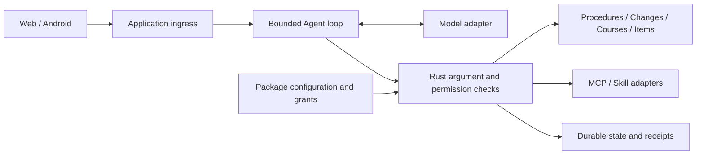

# USTC Campus Agent

A campus assistant for administrative procedures, calendar changes, course comparison and personal items.
Its Plugin Market configures MCP tools and Skill guidance for the Agent. Models propose calls; Rust validates permissions and executes them.

[简体中文](README.md) · [Capabilities and scoring evidence](docs/features/06-mvp-core-capabilities.md) · [Demo walkthrough](docs/guides/competition-demo.md) · [Documentation](docs/README.md)

A student competition project, not an official USTC service. The current version supports local/WSL use and administrator-configured accounts on a loopback service. University SSO and public deployment require separate integration and acceptance.

<a id="overview"></a>
<a id="features"></a>

## What works

| Task | Current result | Inputs and conditions |
|---|---|---|
| Transcript-certificate procedure | Conditions, steps, official links and an exportable personal checklist | Fixed reviewed procedure data |
| Academic-calendar changes and official information | Reviewed examples plus searchable local source observations and line differences | Optional operator-reviewed exact public URLs; observations do not publish official facts |
| Course comparison | Alternatives from supplied course evidence, prerequisites, interests and free time | Consent for this request; cites supplied excerpts; no iCourse rating collection |
| Personal items | Confirm dated additions, edits, deletion and course batches; retain after restart | Beijing time displayed; newly confirmed dated items receive durable in-app reminders |
| Agent extensions | Install, configure, grant, enable, update/roll back, disable and revoke | Reviewed public-read MCP, Skill or mixed packages; imports first produce files for review |

Chat supports saved history, follow-up questions, pinning, groups and deletion. History uses date order; renaming preserves the `YYMMDD|` prefix.
Personal Agent instructions can be saved in Settings and apply from the next message
across saved conversations. See the [root prompt contract](docs/contracts/agent-root-prompt.md).
The model selector sits beside the composer. Answers appear incrementally; runs can be stopped, and completed tool progress survives restart. Stopping does not undo committed effects. Administrator controls are secondary.

<a id="quick-start"></a>

## Run from source

Use Linux/WSL, Git and the Rust toolchain pinned by the repository:

```bash
git clone https://github.com/Develata/ustc-campus-agent.git
cd ustc-campus-agent
bash scripts/run_three_plugin_mvp.sh
```

Open <http://127.0.0.1:8787>. These Chinese prompts exercise the deterministic demo:

```text
成绩单证明怎么办？
校历最近有什么变化？
记录事项：准备成绩单申请材料
列出我的待办事项
```

They query a transcript procedure, inspect calendar changes, record an item and list items.
For course planning, enter course excerpts, preferences and free time in Plugins and consent to this request. The older demo-profile path remains in demo mode. See [campus workflows](docs/guides/campus-workflows.md) for configured accounts, source manifests and course-to-calendar confirmation.
For packaged execution, see the [Docker Compose guide](deploy/mvp-compose/README.md).
Current development sources and the historical R3.1 package have different feature scopes.
Mock execution needs no key or model network; an initial build may still download dependencies and images.

### Models and plugins

| Mode | Scope |
|---|---|
| `mock` | Deterministic execution of four built-in campus tools; no installed MCP/Skill calls |
| `local-chat` | Text-only connection testing with a small local model; no tools |
| `openai-compatible` | A configured tool-capable model can call currently authorized built-in and package tools |

Endpoints and private key files are configured on the server. The browser selects an admitted model ID.
See [model configuration](docs/guides/model-selection.md) and [MCP/Skill configuration](docs/guides/mcp-skills.md).
Installation does not grant permission; every invocation checks current state, arguments and authority.

<a id="architecture"></a>

## Implementation and competition evidence



| Scoring dimension | Demonstrable evidence |
|---|---|
| Innovation | Campus tasks, source checks and permissioned plugins through one Chat entry |
| Practicality | Working procedure lookup, saved items and course comparison with explicit prerequisites |
| Technical difficulty | Model/tool protocols, validation, source boundaries, bounded execution, revocation and exact retries |
| Completion | Runnable Web and Android debug clients, verification commands, architecture and recording instructions |

See the [capability and evidence map](docs/features/06-mvp-core-capabilities.md) for detailed criteria.
Planned RAG, multi-agent workflows and production features are not presented as implemented. Test evidence does not establish a competition score.

<a id="privacy"></a>
<a id="boundaries"></a>

## Data and current limits

- Built-in procedure/change demos retain reviewed fixtures. Optional retrieval is limited to exact public USTC URLs in an operator-reviewed permission manifest; stored observations are not canonical publications. Personal course planning cites user-supplied evidence. The older demo catalog includes an iCourse rating snapshot whose permission remains unresolved; the new path does not collect those ratings.
- Private course input requires request-specific consent. Calendar proposals and batches require separate confirmation; reminders are delivered to the in-app inbox only, without OS push, email or SMS. Restart retains completed tool evidence and never automatically redispatches interrupted tools.
- The server binds to loopback. Model credentials come from private server files and never enter the page, repository or tool receipts.
- Local administrator-configured login/logout scopes private state to the admitted user; no self-registration is provided. University SSO, public HTTPS/proxy admission and distributed operation remain unfinished. Plugin support remains bounded: no stdio, executable Skills or private/write MCP capabilities.

<a id="android"></a>

## Android

The debug APK uses `adb reverse` to reach the same Rust backend and renders Chat and plugins in Android WebView.
See the [Android guide](docs/guides/android-demo.md) for installation, explicit device selection and evidence boundaries.
The current local build passed; Xiaomi installation was blocked by device policy, so physical-device feature acceptance remains unverified.

<a id="development"></a>

## Development and verification

```bash
cargo fmt --all -- --check
cargo clippy --locked --all-targets --all-features -- -D warnings
cargo test --locked --all-targets --all-features
python3 scripts/check_repo_contracts.py
```

Run affected-module tests during development and the baseline at integration checkpoints.
These commands describe checks, not their results. See the [development guide](docs/guides/development.md),
[acceptance matrix](docs/acceptance/matrix.tsv) and [AGENTS.md](AGENTS.md).

<details>
<summary>Session and audit storage</summary>

`m00-sessions.json` is the `event-history-only` current-session read authority.
The `B4b stable redacted control-event/error` journal is `data-only` evidence, not an authentication or administrator API.

</details>

<a id="documentation"></a>

## Documentation

[Capabilities and evidence](docs/features/06-mvp-core-capabilities.md) · [Demo and submission](docs/guides/competition-demo.md) · [Models](docs/guides/model-selection.md) · [Plugins](docs/guides/mcp-skills.md) · [Technical map](docs/README.md)

<a id="license"></a>

## License

Project-authored code and documentation use the [MIT License](LICENSE.md). Rights to third-party content and campus data are established separately.
