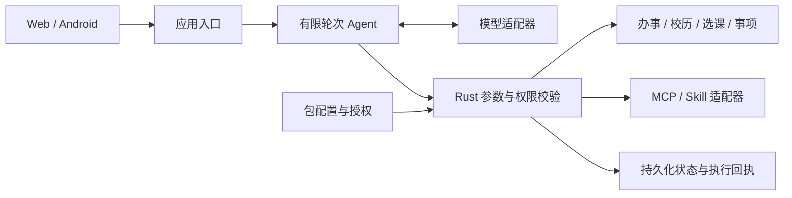

# USTC Campus Agent

通过对话查询校园办事流程、查看校历变化、规划课程并管理个人事项。
Plugin Market 提供可配置的 MCP 工具与 Skill 指南，模型提出调用，Rust 校验权限并执行。

[English](README.en.md) · [功能与评分证据](docs/features/06-mvp-core-capabilities.md) · [四分钟演示](docs/guides/competition-demo.md) · [文档导航](docs/README.md)

学生竞赛项目，非中国科学技术大学官方服务。当前可运行版本为本机演示，使用固定来源和演示用户；生产多用户与学校 SSO 尚未接入。

<a id="overview"></a>
<a id="features"></a>

## 可以完成什么

| 校园任务 | 当前结果 | 数据与使用条件 |
|---|---|---|
| 办理成绩单证明 | 查询条件、步骤、官方入口；导出个人办理清单 | 经审阅的固定流程资料 |
| 查看校历变化 | 查看版本差异、来源和变更板 | 经审阅的固定校历样例 |
| 比较课程方案 | 按演示档案生成候选方案及理由 | 本次请求需明确同意使用档案；课程数据边界见下文 |
| 管理个人事项 | 记录、列出；日期新增／修改／删除先预览确认，重启后保留 | 北京时间明确显示，尚无提醒投递 |
| 给 Agent 添加能力 | 安装包、配置、检查、授权、启用、停用和撤销 | 已审阅的单组件只读 MCP/Skill 包 |

对话支持历史保存、继续追问、重命名和删除；首轮自动生成 `YYMMDD|话题` 标题。
设置中可保存个人 Agent 根提示词，为后续对话设定角色、任务处理方式和回答习惯。
模型选择位于输入框旁，执行过程展示实际工具状态和来源，管理员演示控件独立收纳。

<a id="quick-start"></a>

## 快速运行

源码启动需要 Linux/WSL、Git 和仓库指定的 Rust 工具链：

```bash
git clone https://github.com/Develata/ustc-campus-agent.git
cd ustc-campus-agent
bash scripts/run_three_plugin_mvp.sh
```

打开 <http://127.0.0.1:8787>，依次尝试：

```text
成绩单证明怎么办？
校历最近有什么变化？
记录事项：准备成绩单申请材料
列出我的待办事项
```

日历面板支持手动填写日期、预览和确认；支持工具调用的模型也可提出日历提案，模型不能代替你确认。见[日历操作](docs/guides/calendar-proposals.md)。

选课前先创建演示档案，并确认仅本次 Chat 使用。
使用已有程序包见 [Docker Compose 指南](deploy/mvp-compose/README.md)；当前开发源码与历史 R3.1 包的功能范围不同。
默认 mock 无需密钥，也不访问模型网络；首次构建仍可能下载依赖和镜像。

### 模型与插件

| 模型模式 | 适用范围 |
|---|---|
| `mock` | 离线演示四项内置校园工具，不调用安装的 MCP/Skill |
| `local-chat` | 本地小模型文本连接测试，不调用工具 |
| `openai-compatible` | 使用支持工具调用的真实模型，执行已授权的内置和插件工具 |

模型地址与密钥文件在服务端配置，浏览器只选择已配置的模型。
详见 [模型配置](docs/guides/model-selection.md)和 [MCP/Skill 配置](docs/guides/mcp-skills.md)。
插件安装不等于授权；真实调用前仍检查当前状态、参数和权限。

<a id="architecture"></a>

## 技术实现与评分证据



| 评分维度 | 当前可展示的依据 |
|---|---|
| 创新性 | 将校园任务、来源核对与可授权插件组合在同一 Chat 入口 |
| 实用性 | 办事查询、事项保存、课程比较等可操作流程及清楚的使用条件 |
| 技术难度 | 模型工具协议、参数校验、来源约束、有限执行、权限撤销和精确重试 |
| 完成度 | 可运行 Web 与 Android 调试客户端、验证命令、架构说明和录像步骤 |

完整细分项与验证入口见[功能与评分证据](docs/features/06-mvp-core-capabilities.md)。
未完成的 RAG、多智能体工作流和生产功能不计作现有能力；测试通过也不代表获得比赛评分。

<a id="privacy"></a>
<a id="boundaries"></a>

## 数据与当前边界

- 办事与校历使用固定审阅资料，不提供实时校园抓取。课程目录包含合成课程事实及 iCourse 聚合评分快照；后者的数据使用许可仍待闭环。
- 私有档案按请求同意；事项写入要求明确指令或确认服务端提案。日期与修改提案已接入；批量写入、提醒和流式输出尚未实现。
- 服务默认只监听 loopback；密钥从私有服务端文件读取，不进入页面、仓库或工具回执。
- 用户入口规划为 SSO 或后台配置用户，不提供自助注册。生产认证、多用户服务和真实校园账号集成仍待完成。

<a id="android"></a>

## Android

Android 调试 APK 通过 `adb reverse` 连接同一 Rust 后端，在手机 WebView 中使用 Chat 和插件界面。
安装、指定设备连接、排错及实际验证范围见 [Android 指南](docs/guides/android-demo.md)。
当前本机构建通过；小米真机安装被系统权限阻断，尚未完成真机功能验收。

<a id="development"></a>

## 开发与验证

```bash
cargo fmt --all -- --check
cargo clippy --locked --all-targets --all-features -- -D warnings
cargo test --locked --all-targets --all-features
python3 scripts/check_repo_contracts.py
```

开发中先运行受影响模块测试，集成时运行上述基线；命令列表不是执行成功的声明。
操作步骤见[开发指南](docs/guides/development.md)，正式范围由[验收矩阵](docs/acceptance/matrix.tsv)定义。
贡献前阅读 [AGENTS.md](AGENTS.md)。

<details>
<summary>会话与审计存储约束</summary>

`m00-sessions.json` 为 `event-history-only` 当前会话读取权威；
`B4b stable redacted control-event/error` journal 为 `data-only` 证据，不替代认证或管理员 API。

</details>

<a id="documentation"></a>

## 文档

[功能与评分证据](docs/features/06-mvp-core-capabilities.md) · [演示与提交](docs/guides/competition-demo.md) · [模型配置](docs/guides/model-selection.md) · [插件配置](docs/guides/mcp-skills.md) · [技术文档地图](docs/README.md)

<a id="license"></a>

## 许可证

项目自有代码与文档采用 [MIT License](LICENSE.md)；第三方内容与校园数据的使用权分别确认。
