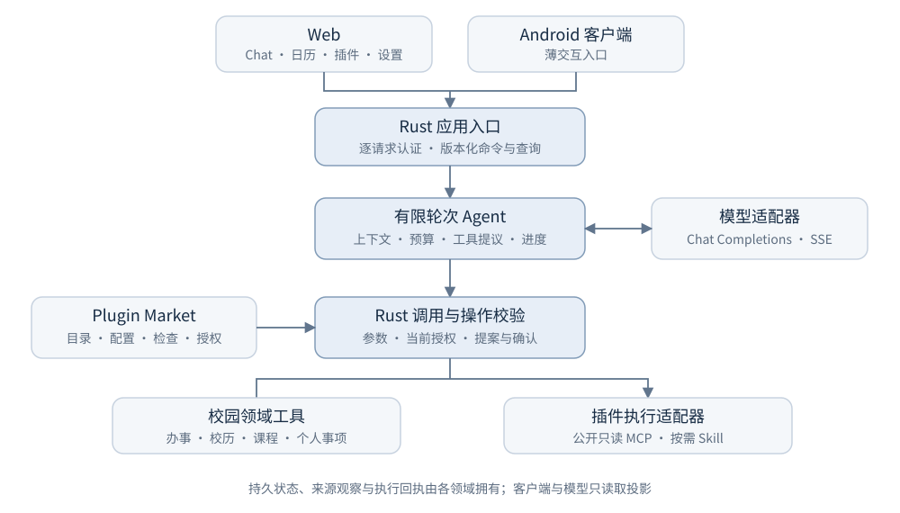

# USTC Campus Agent 设计文档

面向科大学生的插件化校园智能体 · 一〇七杯智能体赛道

本文说明当前竞赛候选的设计与可展示能力。项目由参赛团队开发，非中国科学技术大学官方服务；具体程序版本与运行检查随提交包记录。本文是设计说明，不替代各模块的正式契约。

## 1. 场景与设计思路

学生准备成绩单、安排课程或跟进校历时，需要在通知页面、办事指南、课程材料和个人日历之间反复切换。一般聊天模型能够给出建议，却容易混淆过期资料、社区意见和官方规则，也无法仅凭一句“已完成”证明事项真正保存。

USTC Campus Agent 将这些任务收进一个 Chat 入口：用户描述目标，Agent 查询受控资料、调用已授权工具，返回带来源的结果；涉及日期安排或修改时，先提出可核对的操作，再由用户确认。Plugin Market 是能力入口，负责说明来源、使用条件、配置和授权，不要求用户理解内部工具协议。

设计重点有三项：让查询结果可以追溯，让实际操作可以确认与回读，让新能力可以作为插件接入。模型负责理解与表达，Rust 负责参数、权限、状态和执行规则，避免把模型输出当成业务事实。

## 2. 中心服务与模块边界

系统采用中心服务架构：浏览器和 Android 客户端连接同一个 Rust 后端，后端统一维护账号、会话、插件状态与执行回执。当前已验证范围是本机／WSL 的后台配置多账号服务；公网部署与学校 SSO 尚需配置和验收。中心化是产品的状态归属方式，不是已经公开上线的声明。

**主调用链：Web／Android → 认证与应用入口 → 有限 Agent → Rust 调用校验 → 校园工具／MCP／Skill → 持久结果与回答。**

| 层次 | 责任与状态归属 |
|---|---|
| 交互层 | Chat、月历、插件、设置；显示进度与结果，提交用户意图 |
| 应用入口 | 认证、版本化请求、应用命令组装；不重写领域规则 |
| Agent 协调 | 上下文、轮次与调用预算、进度；通过适配器访问模型 |
| 执行领域 | 当前权限与参数校验，校园工具、MCP 与 Skill 的有限执行 |
| 状态与证据 | 各领域拥有会话、安装、授权、来源观察、日历和回执；缓存不能覆盖它们 |

前端只呈现服务端状态并提交用户意图，不直接决定授权或修改存储。应用层负责认证和流程组装；领域模块分别拥有日历、课程约束、包生命周期等规则；模型、MCP、文件和网络适配器处理外部协议。模块通过窄接口组合，可以用受控替身独立测试，减少界面改动对核心执行逻辑的影响。

Rust 是后端与确定性核心的主要实现语言。其所有权、类型检查和无需垃圾回收的运行模型有利于控制常驻服务的资源开销；原生编译程序也便于本地部署。当前重点是正确性、响应体验和可诊断性。i7-12700H、WSL2 Debian 13 环境下，release 程序的 100 次串行日历查询全部成功，中位 3.35 毫秒、P95 4.51 毫秒，计时包含连接、响应与 JSON 解析。该基线不含模型调用，尚不能代表并发吞吐或跨框架优势。

架构权威见[平台边界](../plan/03-platform-authority.md)与[模块接口](../contracts/module-boundaries.md)。

## 3. 主要校园功能

| 功能 | 用户路径 | 当前实现与结果 |
|---|---|---|
| 官方办事信息 | 询问成绩单等证明如何办理，查看步骤与原链接 | 固定审阅流程、个人办理清单；另有管理员来源清单约束下的资料导入、查询、观察时间与版本差异 |
| 校历变化 | 查询校历最近变更，核对前后内容与来源 | 固定变更板与来源说明；观察记录和正式发布分别处理 |
| 选课推荐 | 提供课程原文、先修、学分、完整上课时间、兴趣和空闲时间，明确同意本次使用 | Rust 检查先修和时间冲突，比较方案并解释排除原因；可生成整批日历提案，确认后加入 |
| 个人日历 | 月历选日或在 Chat 提出安排，核对完整日期与北京时间 | 新增、修改、删除、批量提案及持久化；新确认的定时事项到点投递站内提醒，保留投递和已读回执 |

三项第一方产品身份分别是 Affairs Navigator、ChangeRadar 和 Opportunity Graph；课程规划属于 Opportunity Graph，个人日历是配合校园任务的工具。当前没有自动选课、代办学校业务或完整机会图谱。

官方资料工作区保留精确来源、观察时间、审阅状态和版本差异。导入一份观察不等于获得学校发布权，也不等于资料仍然有效。联网获取只接受管理员已审阅的精确公开 HTTPS 来源，默认不附带获授权来源，不使用学校登录 Cookie，不自动扩大站点范围。

课程建议区分课程原文、社区参考和模型的学科判断。新个人课程输入流程不采集 iCourse 评分；历史样例包含少量 iCourse 聚合评分快照，其数据使用许可尚未闭环。本次程序包采用明确标注的自建合成课程变体，移除历史聚合评分与其来源声明；模型建议和社区意见不写成学校事实。详情见[校园任务指南](campus-workflows.md)。

## 4. Agent 执行、确认与恢复

一次请求按“接收任务 → 构造受限上下文 → 模型提出工具调用 → Rust 校验 → 实际执行 → 记录结果 → 生成回答”推进。执行受模型轮次、工具次数、上下文预算和超时限制；无权限、参数不符、来源变化或预算耗尽均产生明确状态。

日期新增、修改、删除与批量课程先生成提案。界面展示标题、完整日期、时区及目标事项，只有独立的用户确认才能提交；模型不能调用确认接口。旧式精确命令“记录事项：标题”和“删除事项 ID”保留直接明确意图路径。提案确认和事项变更共同保存，原请求重试返回已保存结果，避免重复写入。

对话保存历史、工具进度和实际模型身份。回答增量显示，用户可停止执行；停止不撤销已完成操作。刷新或重启后可查看已有进度，结果不明时检查原请求，不自动重放写操作。复杂长期任务的自动恢复和多智能体任务图仍是后续工作。

## 5. Plugin Market、MCP 与 Skills

插件包是统一安装单元。一个包可以声明 Skill、MCP 或两者组合，使用“安装 → 配置 → 检查组件 → 审阅权限 → 授权启用”的流程。检查只验证连接、清单或资源，不执行实际业务工具；启用后，每次调用仍核对当前包版本、配置与授权。停用或撤销会阻止后续调用。

MCP 采用受限的 Streamable HTTP，支持 JSON/SSE、分页工具发现、调用与会话关闭；只接入已审阅的公开只读能力。输入 schema 由 Rust 校验，未知约束明确拒绝。Skill 作为带来源的操作指南按需读取，资源路径和内容版本受声明约束；正文不会作为脚本执行，`allowed-tools` 也不会授予权限。

页面可把 MCP 映射和 Skill 原文整理为可审阅的候选包，下载后由管理员纳入目录，再复用授权流程。更新与回滚要求检查目标版本并确认，版本切换使旧授权失效，防止升级隐含扩权。任意主机命令、中心主机 stdio 和私有写工具尚未开放。具体兼容范围见[MCP／Skills 指南](mcp-skills.md)。

## 6. 多人服务、模型配置与交互

账号由后台配置，无自助注册或邀请注册；学校 SSO 尚未接入。服务逐请求验证会话，私有日历、对话、根提示词及插件配置与授权按账号隔离，公共包目录和已审阅公开资料共享。密码散列和模型密钥仅留在服务端私有配置；会话凭据通过 HttpOnly Cookie 传递，不进入页面脚本、插件包或执行回执。

模型通过 OpenAI-compatible Chat Completions 接口接入，地址使用配置的 `/v1/chat/completions`，请求带模型标识、消息和工具定义；流式回答通过 SSE 传送。本次材料采用 `gpt-5.6-luna` 作为真实模型测试配置；`deepseek-v4-flash-ascend` 是可配置备选，`hy-mt2` 曾用于本地纯文本连接测试。测试模型标识是服务配置值，不代表所有模型都已验证。API 密钥由服务读取私有文件，提交包使用占位配置。

输入框旁的模型按钮仅列服务端已配置模型，运行中锁定；历史保留实际模型。设置支持个人根提示词，但不能覆盖权限和确认规则。对话按 `YYMMDD|话题` 命名，支持重命名后缀、置顶、分组与删除。工具轨迹按需展开，阅读历史时保持滚动位置，月历与插件页面适配窄屏。

## 7. 技术难点与评分对应

| 评分维度 | 本作品的技术与演示依据 |
|---|---|
| 创新性 | 将校园来源核对、课程约束、个人事项和可授权插件组织为一个对话流程；创新定位是校园工作流与可信执行的组合 |
| 实用性 | 从“找到流程”继续到“保存安排”，展示可回读结果；来源、个人资料使用条件和未覆盖事项清楚可见 |
| 技术难度 | 模型与工具协议隔离、有限执行预算、确定性约束校验、提案确认、账号隔离、版本变更后重新授权和未知结果恢复 |
| 完成度 | 同一候选的设计文档、实际操作视频、可运行程序及作品简介；检查覆盖浏览器、HTTP、持久化和失败路径 |

核心难点是让不确定的模型提议经过可判定规则变为可追踪结果。检索索引和模型文本不替代来源，浏览器缓存不替代服务端状态，进度动画不替代执行回执。模块测试、受控协议对端、浏览器流程及少量真实模型调用分别验证这些边界。当前没有并发性能得分预测，也不把多个工具称为多个智能体；RAG、多智能体协作和自动模型切换尚未实现。

## 8. 框架参考与自主实现

项目于 2026 年 7 月开始逐步设计，[7 月 22 日的早期规划](https://github.com/Develata/ustc-campus-agent/commit/42158d8e0bfb2cb4efc13e951ece9512509b7274)已包含 Market-first 与自有 Rust 核心；DeepSeek Harness 于同年 8 月公开发布，[官方页面](https://deepseek.com/harness/)目前仍将其定位为开发者预览。这一时间线说明本项目的基本方向先于该公开发布，不作为技术优越性或排他原创性的证明。

DeepSeek Harness 同样采用插件式扩展，主要面向个人开发者的本地工作环境。我们参考了其公开实现中的交互组织、紧凑执行轨迹和插件使用体验；UCA 则围绕中心校园服务设计，共享公开能力目录，统一认证并隔离不同用户的私有状态，强调校园来源、明确确认与执行回执。

DSH 使用 [MIT 许可证](https://github.com/deepseek-ai/deepseek-harness/blob/master/LICENSE)，允许遵循条款的修改与再分发。我们延续自有 Rust 实现，主要考虑已形成的领域契约、中心多人服务边界、资源控制和长期维护，同时保留第三方许可与引用。性能描述以本项目限定范围的实测为依据。

## 9. 交付与未完成范围

本次程序候选为 `a1988e892a6bad42a56032dd9de96701d64fbcf1`，交付 Web 界面、Linux/WSL Rust 程序及可离线导入的 Docker 镜像；Docker load、Compose 启动、健康检查和查询通过。历史 R3.1 冻结包与当前源码功能不同。本次附同源新构建的 Android 调试 APK，端点测试、lint 与签名检查通过；小米真机安装、Chat 首页启动和 WebView 日历查询通过，未执行全面手机回归。公网多用户、学校 SSO、获许可的真实校园来源运行、完整 RAG／机会图谱及手机系统推送均不作为已完成能力。

复验命令和证据入口见[功能与评分证据](../features/06-mvp-core-capabilities.md)、[验收矩阵](../acceptance/matrix.tsv)和[演示与提交指南](competition-demo.md)。最终包需对应同一运行候选，视频只展示实际成功路径，提交接收状态由队长在比赛入口确认。
